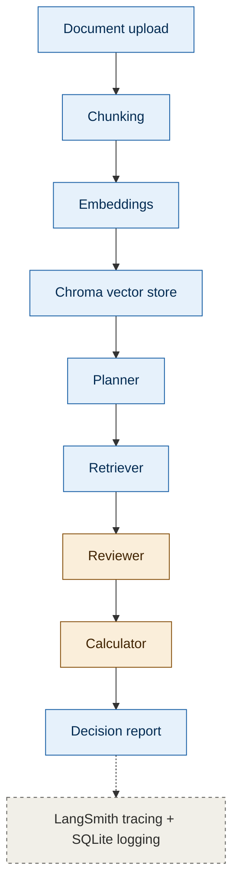

# ClauseGuard Architecture

ClauseGuard is a pipeline, not a single prompt. A document is indexed, then walked through a
LangGraph state machine that ends in a report.

## Pipeline


```mermaid
flowchart TD
    A[Document upload] --> B[Chunking]
    B --> C[Embeddings]
    C --> D[Chroma vector store]
    D --> E[Planner]
    E --> F[Retriever]
    F --> G[Reviewer]
    G --> H[Calculator]
    H --> I[Decision report]
    I -.-> J["LangSmith tracing + SQLite logging"]

    classDef pipeline fill:#E6F1FB,stroke:#185FA5,color:#042C53
    classDef gate fill:#FAEEDA,stroke:#854F0B,color:#412402
    classDef monitor fill:#F1EFE8,stroke:#5F5E5A,color:#2C2C2A,stroke-dasharray: 4 4

    class A,B,C,D,E,F,I pipeline
    class G,H gate
    class J monitor
```

This is a straight line, matching `src/agents/graph.py` exactly:

```
START → planner → retriever → reviewer → calculator → report → END
```

An earlier version of this document showed the Planner forking to the Retriever and the Calculator
in parallel, with both feeding the Reviewer. That was never the shipped graph, and it showed the
Calculator running before the Reviewer, which is the exact bug the reordering fixed. Diagrams drift
from code silently; this one is now generated from reading the edges.

## Nodes

**Chunking** — Splits the document into retrievable pieces. Tries clause numbering first, then
decimal numbering, lettered sections, headings, and paragraphs, using the first that genuinely
splits the text, with fixed-size slicing as a floor. Oversized chunks are split against the
embedding model's real 256-token limit rather than a character estimate. Titles, preambles and
signature blocks are filtered out. See `docs/08` for why clause chunking was kept and how narrow
its margin is over recursive splitting.

**Embeddings** — `sentence-transformers/all-MiniLM-L6-v2`, run locally. 256 word-piece token
limit, which is why chunk size is enforced against its tokenizer.

**Vector store** — Chroma, one collection per document per session. There is no persistent
cross-document index.

**Planner** — Validates the document, then sets up the eight risk categories to check. Coverage is
bounded by that list: a clause outside those categories is never examined. This is a checklist, not
a full document sweep.

**Retriever** — Similarity search over the current document's chunks, k=3. k was 2 until the
retrieval eval measured recall@1 at 75%, recall@2 at 83% and recall@3 at 100%. See `docs/04`.

**Reviewer** — An LLM-as-a-judge. Given a category and the k retrieved candidates, it picks the one
that best answers the category, or returns none if the category is genuinely not addressed. It was
originally an approve-or-reject gate on the top result, which could reject noise but could do
nothing about a miss. Choosing the best of k costs no extra API calls, since it was already one
call per category.

**It has never been evaluated.** Its precision and recall as a judge are unmeasured. That is E2 and
it is the largest gap in this repository.

**Calculator** — Numeric work on fee and cost clauses, for example total exposure from an
escalating late fee. It runs after the Reviewer. An earlier version ran it first, and it produced a
confident dollar figure from a clause the Reviewer rejected as irrelevant moments later. That was
fixed by reordering the graph, not by changing either node.

**Decision report** — Findings grouped as concerning, neutral or favorable, each with a
one-sentence plain-language explanation and the source clause attached.

**Whether each explanation actually follows from its clause is not checked.** That is E3, and it is
the README's core promise going unverified.

## Monitoring

LangSmith traces every node invocation. It is enabled entirely through environment variables,
`LANGSMITH_TRACING`, `LANGSMITH_API_KEY` and `LANGSMITH_PROJECT`, with no application code, since
LangChain and LangGraph pick those up automatically.

A SQLite log records requests in structured form for querying outside LangSmith.

Neither influences pipeline behaviour. Both are tracing only: no evaluator or alert runs on top of
them, and nothing is measured from live traffic.

The traces did surface one thing the evaluation reports could not. Per-call latency ranges from
0.6s to 21.6s on clauses of near-identical length, so the averages in the experiment write-ups hide
a 30x spread that is mostly provider variance.

## Where the evidence lives

| Question | Answered in |
|---|---|
| Does clause chunking beat the alternatives? | `docs/08` |
| Does retrieval find the right clause? | `docs/04` |
| Which model, and why? | `docs/05`, `docs/07` |
| What does `concerning` mean? | `docs/06` |
| Do few-shot examples earn their place? | `docs/09` |
| Is the Reviewer any good? | **nowhere, E2** |
| Do the explanations follow from the clauses? | **nowhere, E3** |
